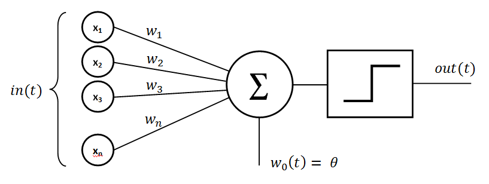

% Tensorflow - Perceptron
% 5º meetup de Deep Learning

# Porque tensorflow

- Tensorflow é uma biblioteca para computação numérica usando grafos computacionais. 
- Em particular, podemos construir expressões matemáticas envolvendo tensores e automaticamente calcular gradientes e minimizar funções.


# Perceptron
{#id .class height=30%}

$y = \phi(w_1 x_1 + w_2 x_2 + \ldots) = \phi(\mathbf{w}\cdot \mathbf{x})$ 


# Code

```python
import tensorflow as tf

# Input
x = tf.placeholder(tf.float32, [None, 10])

```

- O que é um placeholder no tensorflow?
- O que significa `[None, 10]`?
- Escalares, vetores, tensores.
- O que significa `tf.float32`?


# Code

```python
import tensorflow as tf

# Input
x = tf.placeholder(tf.float32, [None, 10])

# Parametros
W = tf.Variable(tf.zeros([10, 1]))
b = tf.Variable(tf.zeros([1]))
```

- O que é uma variável no tensorflow?
- `tf.zeros(...)`

# Code

```python
activation = tf.sigmoid(tf.matmul(x, W) + b)
```

- `tf.matmul(...)`
- `tf.zeros(...)`

# Code

```python
actual_y = tf.placeholder(tf.float32, [None, 1])
loss = tf.reduce_sum(
    -actual_y * tf.log(activation) - 
    (1 - actual_y) * tf.log(1 - activation)
)
```
- :O :O :O :O
- $l = -y \log(q) - (1-y)\log(1-q)$ 

# Code

```python
train_step = tf.train.GradientDescentOptimizer(0.5).minimize(loss)
```

# WHAT?

{#id .class width=80%}

# SGD

```python
init = tf.initialize_all_variables()
sess = tf.Session()
sess.run(init)
for i in range(1000):
  batch_xs, batch_ys = next_batch()
  sess.run(train_step, feed_dict={x: batch_xs, y_: batch_ys})
```

